# BABU BANARASI DAS UNIVERSITY

## Data Integration in SPSS Modeler - Telecom Dataset Analysis

---

**SUBMITTED TO:**  
Mr. Robin Tyagi

**SUBMITTED BY:**  
**Name:** Ganesh Agrhari  
**Roll No:** 1230258126  
**Class:** BCA DS&AI - 33  
**Subject:** Predictive Analytics (BCADSN15301)

---

## Definition: Unit of Analysis & Data Integration in SPSS Modeler

Data integration in SPSS Modeler refers to the systematic process of combining data from multiple disparate sources into a unified, consistent, and comprehensive dataset suitable for advanced analytics. This process involves various operations that transform, consolidate, and refine raw data into actionable information. The primary operations include:

**Merge Operations:** Joining datasets horizontally based on common key fields (such as Customer ID), enabling the combination of related information from different sources into a single record. This is analogous to SQL JOIN operations.

**Append Operations:** Stacking datasets vertically to combine records from multiple sources or time periods, creating a comprehensive historical view of data.

**Aggregate Operations:** Summarizing transactional or detailed data by grouping records and applying statistical functions (sum, count, average, etc.) to create higher-level analytical units.

**Sampling Operations:** Selecting representative subsets of data to improve processing efficiency while maintaining statistical validity.

These integration operations collectively help in removing duplicate records, consolidating information from multiple sources, creating unified datasets for comprehensive analysis, and ensuring data quality and consistency. The result is a single source of truth that provides a 360-degree view of the analytical subject, enabling more accurate predictive modeling and business intelligence.

---

## Outcomes/Learning

Through this practical exercise in data integration using IBM SPSS Modeler, the following key competencies and outcomes were achieved:

- Successfully combined multiple Telco datasets including quarterly call data (Q1 and Q2), customer demographic information, product subscription data, and tariff plan details into a single integrated analytical dataset.

- Mastered the application of Record Operations nodes including Append for combining temporal data, Distinct for removing duplicate customer records, and Sort for organizing data efficiently.

- Implemented multiple Merge operations using different key fields (Customer ID and Tariff) to join datasets based on relational logic, creating comprehensive customer profiles.

- Applied Aggregate functions to transform transactional call records into customer-level summary metrics, including total call duration, charges, and call frequency.

- Utilized Field Operations including Type node for examining measurement levels and Set to Flag node for converting categorical product data into binary indicators suitable for predictive modeling.

- Implemented sampling techniques (1-in-3 sampling) to create representative subsets of large datasets, balancing analytical needs with computational efficiency.

- Developed understanding of data flow design in SPSS Modeler, creating a logical sequence of operations that ensures data quality, consistency, and analytical readiness for downstream predictive analytics applications.

---

## Required Tool

**IBM SPSS Modeler**

IBM SPSS Modeler is a comprehensive data mining and predictive analytics platform that provides visual programming capabilities for building analytical workflows. It offers extensive data preparation, transformation, and integration capabilities through an intuitive drag-and-drop interface.

---

## Working: Step-by-Step Data Integration Process

### Step 1: Importing Initial Call Data

Added two Statistics File nodes to the SPSS Modeler canvas to establish the foundation for data integration. The first node imported the Telco X Call Data Q1 dataset, while the second node imported the Telco X Call Data Q2 dataset. These datasets contained detailed quarterly call records for Telco X customers, including information such as customer identifiers, call timestamps, call duration, charges, and other transactional details.

**Purpose:** Establish base datasets for integration by importing raw call data from multiple time periods.

**Result:** Two separate data streams representing Q1 and Q2 call records were successfully loaded into the modeling environment.

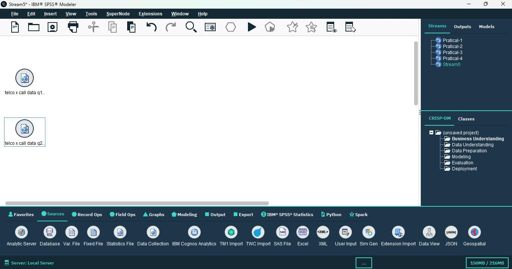

*Figure 1: Statistics File nodes importing Telco X Call Data Q1 and Q2*

---

### Step 2: Appending Call Data Records

Added an Append node from the Record Ops category to combine the quarterly datasets vertically. Both Q1 and Q2 data streams were connected as inputs to the Append node. The configuration was set to stack both quarters' data vertically, creating a complete six-month call history dataset. The append operation was applied and confirmed, ensuring that all records from both time periods were preserved in the combined output.

**Purpose:** Combine multiple time periods into a single comprehensive dataset, creating a complete historical view of customer call behavior.

**Result:** A unified call data stream containing records from both Q1 and Q2, effectively doubling the temporal coverage for analysis.

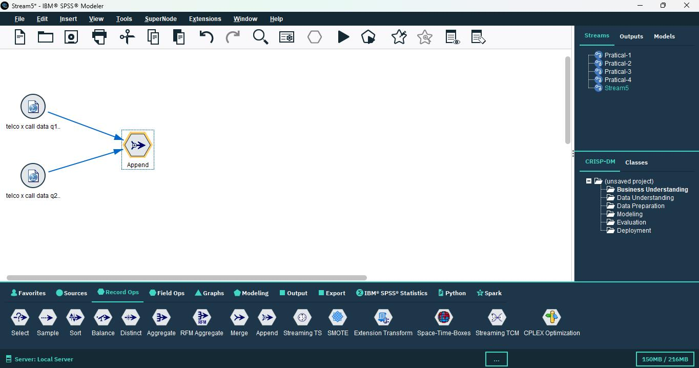

*Figure 2: Append node configuration showing both datasets connected*

---

### Step 3: Sorting Combined Data

Added a Sort node from the Record Ops category to organize the appended call data systematically. The sorting configuration was established with two levels of criteria: Customer ID as the primary sort key in ascending order, and Month as the secondary sort key in ascending order. This hierarchical sorting ensures that all records for each customer are grouped together and arranged chronologically within each customer group.

**Purpose:** Organize data for efficient aggregation and merging operations, ensuring optimal performance in subsequent data processing steps.

**Result:** Call records were systematically arranged by customer and time, facilitating accurate aggregation and analysis.

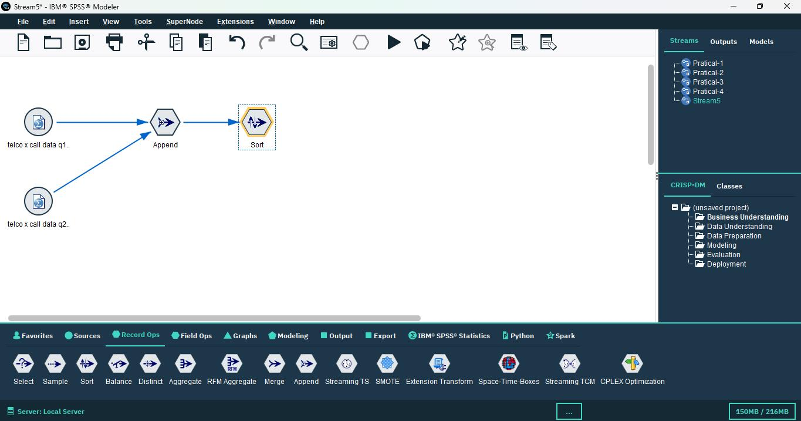

*Figure 3: Sort node configuration with Customer ID and Month sorting*

---

### Step 4: Aggregating Call Data by Customer

Connected an Aggregate node to the sorted data stream to transform transactional call records into customer-level summary metrics. Customer ID was designated as the key field for grouping records. Multiple aggregation functions were applied including Sum functions for calculating total call duration and total charges per customer, and Count functions for determining the number of calls made by each customer during the analysis period.

**Purpose:** Create customer-level summary metrics from detailed call records, transforming transactional data into analytical units suitable for customer profiling and predictive modeling.

**Result:** Each customer was represented by a single record containing aggregated metrics summarizing their call behavior, usage patterns, and spending.

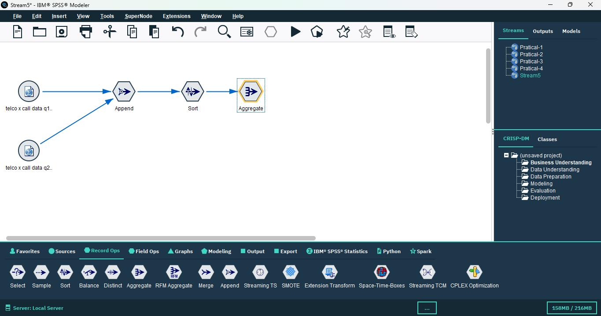

*Figure 4: Aggregate node showing Customer ID as key field with aggregation settings*

---

### Step 5: Merging Aggregated Data

Added a Merge node from the Record Ops category to begin the process of enriching the aggregated call data with additional customer information. Customer ID was configured as the key field for joining datasets. The appropriate join type was selected to ensure proper matching of records between the aggregated call data and other customer-related datasets. This first merge operation established the foundation for creating comprehensive customer profiles.

**Purpose:** Combine aggregated call data with other customer information sources, beginning the process of creating a unified customer view.

**Result:** Call behavior metrics were successfully linked with customer records, preparing the dataset for additional enrichment.

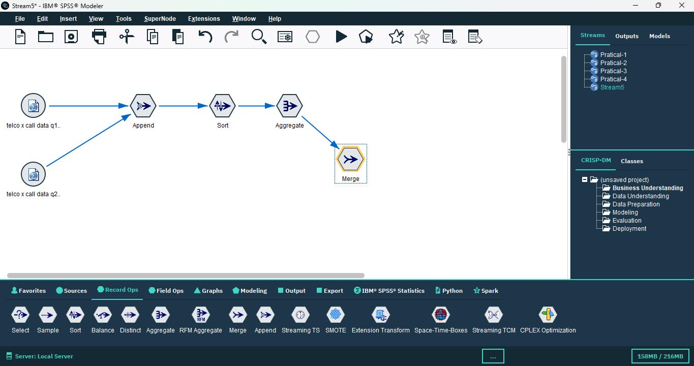

*Figure 5: First Merge node configuration with Customer ID as key field*

---

### Step 6: Viewing Initial Results

Added a Table node from the Output category to visualize the results of the initial merge operation. The stream was executed to generate output, allowing for inspection of the merged dataset structure, field names, data types, and sample records. This quality check verified that the merge operation completed successfully and that data integrity was maintained throughout the integration process.

**Purpose:** Perform quality check and validation before proceeding with additional integrations, ensuring data accuracy and completeness.

**Result:** Confirmed successful integration of call data with proper field alignment and no data loss or corruption.

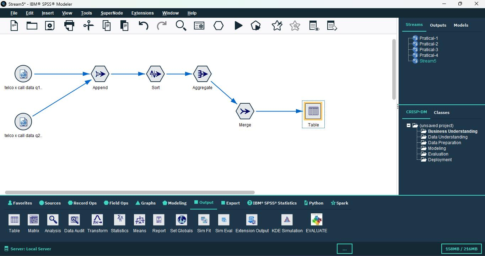

*Figure 6: Table output showing initial merged dataset*

---

### Step 7: Importing Customer Master Data

Added an Excel File node to the canvas to import customer demographic and profile information. The Telco X Customer Data file was loaded, containing comprehensive customer master data including Customer ID, demographic attributes (age, gender, location), account details, customer tenure, and other profile information essential for customer segmentation and predictive analytics.

**Purpose:** Add customer profile and demographic information to the integrated dataset, enriching call behavior data with customer characteristics.

**Result:** Customer master data was successfully imported and made available for integration with the existing call data stream.

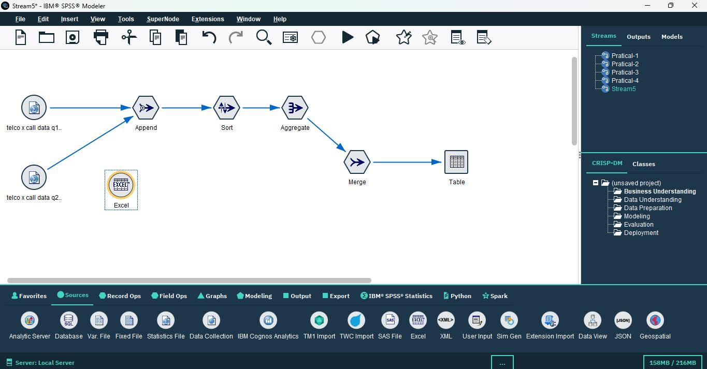

*Figure 7: Excel File node importing Telco X Customer Data*

---

### Step 8: Removing Duplicate Customer Records

Added a Distinct node from the Record Ops category to ensure data quality by eliminating duplicate customer records. All fields were selected as key values to identify truly unique records based on complete record comparison. The configuration was set to keep the first occurrence of each unique record and remove all subsequent duplicates. The output of the Distinct node was then connected to the Merge node to ensure only clean, deduplicated customer data was integrated.

**Purpose:** Ensure one record per customer and eliminate data redundancy, maintaining data integrity and preventing analytical errors caused by duplicate records.

**Result:** Customer master data was cleansed of duplicates, ensuring accurate one-to-one relationships in subsequent merge operations.

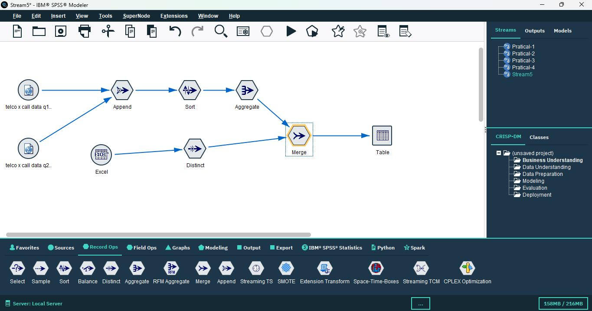

*Figure 8: Distinct node configuration with all fields selected as key values*

---

### Step 9: Importing Product Data

Added a Var File node to the canvas to import product subscription information. The Telco X Product Data file was loaded, containing detailed information about products and services subscribed by each customer. This dataset included fields indicating customer ownership of various products such as gadgets, accessories, premium services, and other telecom offerings.

**Purpose:** Add product ownership and subscription information to customer profiles, enabling product-based segmentation and cross-sell/up-sell analysis.

**Result:** Product subscription data was successfully imported and prepared for transformation and integration.

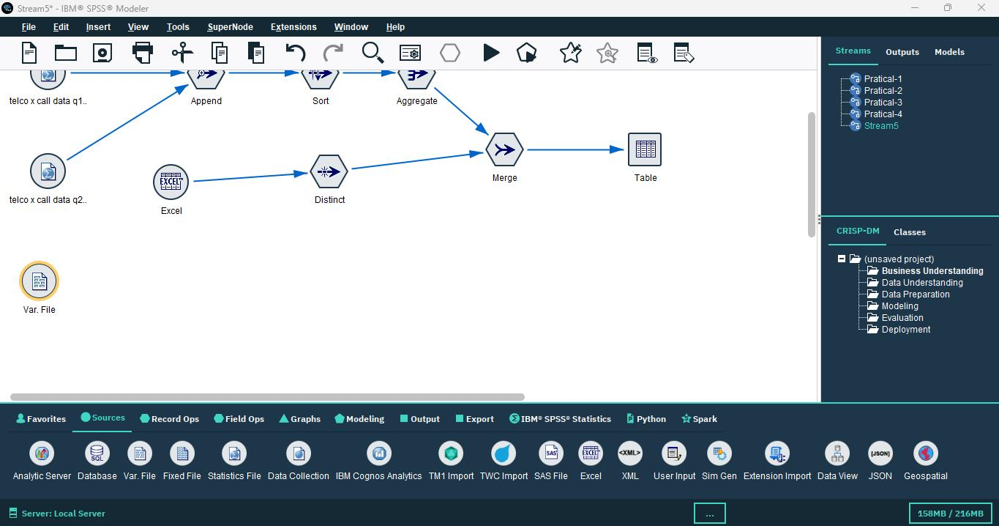

*Figure 9: Var File node importing Telco X Product Data*

---

### Step 10: Examining and Transforming Field Types

Connected a Type node to examine and classify the measurement levels of fields in the product dataset. Initial automatic classification identified fields as either Continuous (numeric measurements) or Categorical (discrete categories). After processing and analysis, fields were systematically reclassified into appropriate measurement types: Flag (binary indicators representing Yes/No or 0/1), Nominal (unordered categories), Ordinal (ordered categories), and Typeless (fields without assigned measurement level).

**Purpose:** Ensure proper data types and measurement levels for accurate analysis and modeling, as SPSS Modeler uses measurement levels to determine appropriate analytical techniques.

**Result:** All fields were properly classified, ensuring that subsequent operations and analyses would treat data appropriately based on their true nature.

*Figure 10: Type node showing field classification before and after processing*

---

### Step 11: Converting Product Data to Flags

Connected a Set to Flag node after the Type node to transform categorical product fields into binary flag format suitable for predictive modeling. Product fields such as Gadgets and other subscription indicators were converted from text-based Yes/No values to numeric binary format (1 for Yes, 0 for No). The configuration ensured consistent transformation across all product fields. The output of this node was then connected to the Merge node to integrate the transformed product data.

**Purpose:** Create binary indicators for product ownership, enabling easier analysis, modeling, and interpretation in predictive analytics applications.

**Result:** Product subscription data was transformed into a format optimal for machine learning algorithms and statistical analysis.

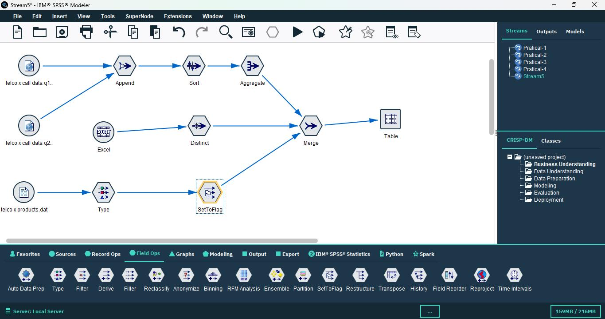

*Figure 11: Set to Flag node configuration converting product fields to binary format*

---

### Step 12: Importing Tariff Plan Data

Added another Var File node to import pricing and tariff plan information. The Telco X Tariff Data file was loaded, containing detailed information about the pricing plans, rate structures, and tariff categories associated with each customer. This dataset included tariff identifiers, plan names, pricing tiers, and other billing-related information.

**Purpose:** Add pricing plan details to the integrated customer view, enabling revenue analysis, price sensitivity modeling, and tariff-based segmentation.

**Result:** Tariff plan data was successfully imported and prepared for integration with the comprehensive customer dataset.

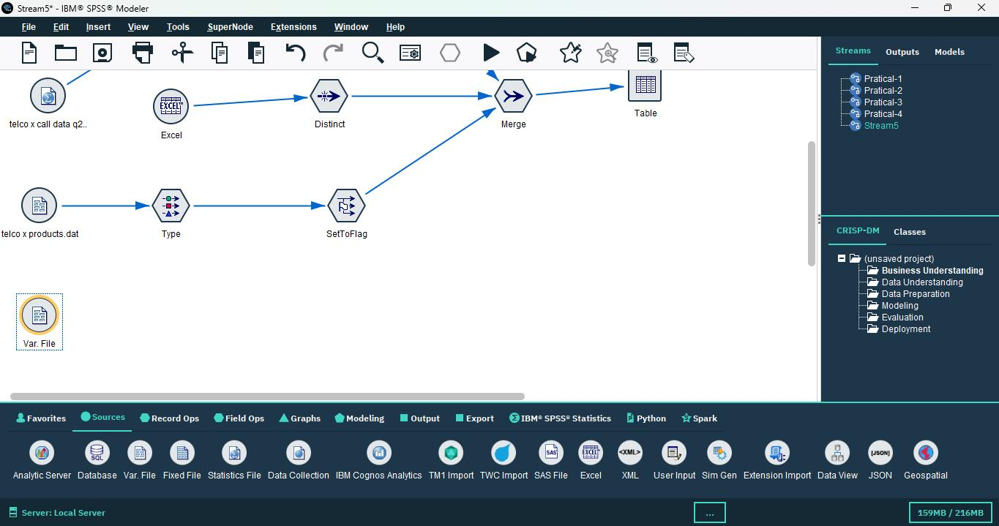

*Figure 12: Var File node importing Telco X Tariff Data*

---

### Step 13: Merging Tariff Information

Added a second Merge node to integrate tariff plan information with the existing customer dataset. This node was connected to the output of the previous Merge node, creating a sequential integration pipeline. The Tariff field was designated as the key field for joining, enabling customers to be matched with their corresponding pricing plan details. The appropriate join type was applied to ensure all customers were matched with their tariff information.

**Purpose:** Complete the customer profile with pricing and billing information, creating a comprehensive 360-degree view of each customer.

**Result:** Customer records were successfully enriched with tariff plan details, completing the core data integration process.

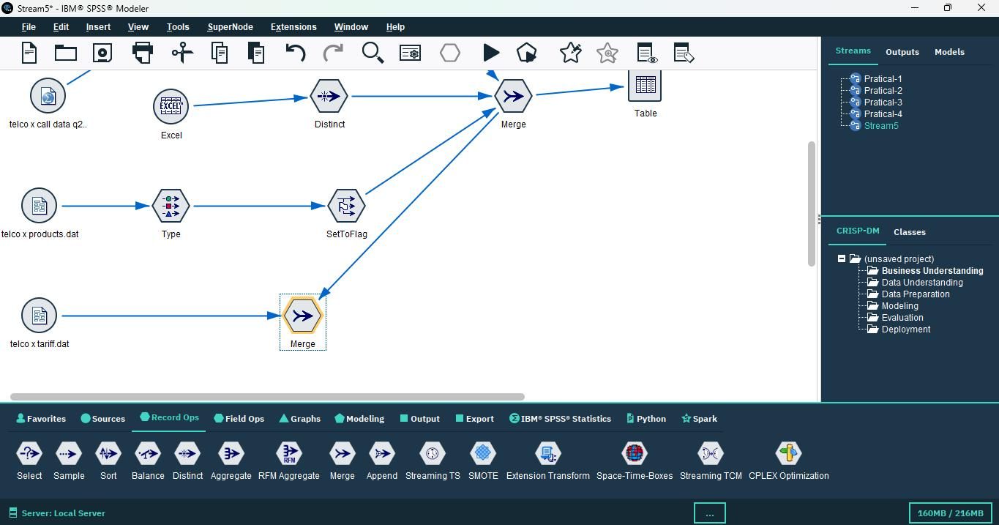

*Figure 13: Second Merge node using Tariff as key field*

---

### Step 14: Creating a Representative Sample

Added a Sampling node from the Record Ops category to create a manageable subset of the integrated dataset while maintaining statistical representativeness. The 1-in-n sampling method was applied with a configuration of 1 in 3, meaning every third record was selected for the sample. This resulted in a sample containing approximately 33.33% of the complete integrated dataset, significantly reducing computational requirements while preserving the statistical properties of the full dataset.

**Purpose:** Reduce dataset size while maintaining representativeness for analysis, enabling faster model development and testing without sacrificing analytical validity.

**Result:** A representative sample was created, containing one-third of the integrated records with maintained distribution of all variables.

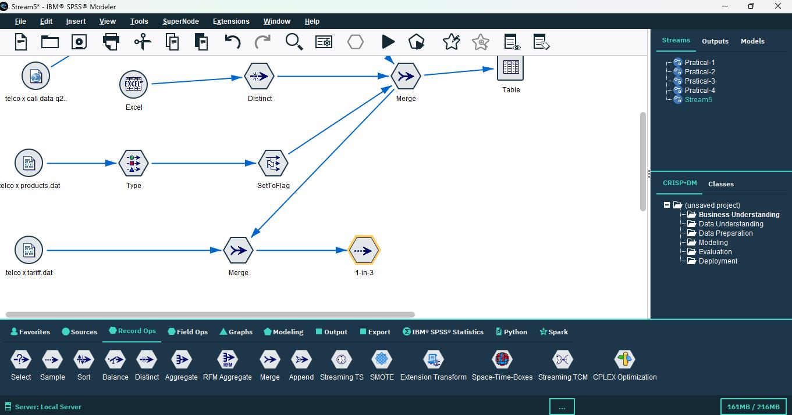

*Figure 14: Sampling node configuration showing 1-in-3 sampling method*

---

### Step 15: Final Output Generation

Added a Table node from the Output category to generate and visualize the final integrated dataset. The complete data integration stream was executed end-to-end, processing all operations from data import through transformation, integration, and sampling. The output was verified to ensure all integrations were successful and data quality was maintained throughout the process.

**Result:** A single unified dataset was successfully created containing comprehensive customer information including call history aggregates (total duration, charges, call counts), customer demographics and profile information, product subscriptions represented as binary flags, tariff plan details, and a representative sample suitable for efficient analysis. This integrated dataset provides a complete 360-degree view of customers and is ready for advanced predictive analytics applications.

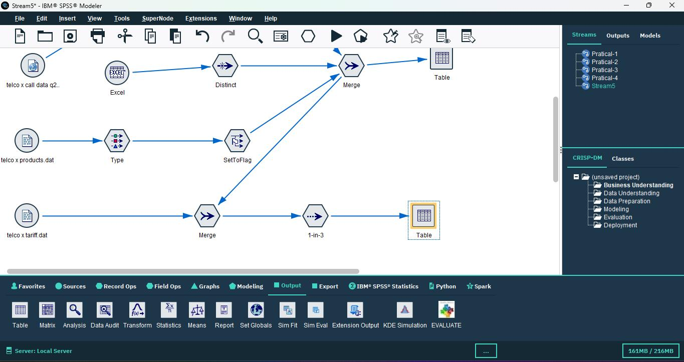

*Figure 15: Final Table output showing the complete integrated dataset*

---

## Data Integration Flow

### Source Data:

1. **Telco X Call Data Q1** - First quarter call records with transactional details
2. **Telco X Call Data Q2** - Second quarter call records with transactional details
3. **Telco X Customer Data** - Customer demographics and profile information
4. **Telco X Product Data** - Product subscriptions and service ownership
5. **Telco X Tariff Data** - Pricing plans and tariff information

### Integration Operations:

1. **Append** → Combine Q1 and Q2 call data vertically to create complete temporal coverage
2. **Sort** → Organize records by Customer ID and Month for efficient processing
3. **Aggregate** → Summarize transactional call records into customer-level metrics
4. **Distinct** → Remove duplicate customer records to ensure data quality
5. **Merge (1st)** → Join aggregated call data with customer demographic data using Customer ID
6. **Type & Set to Flag** → Transform categorical product data into binary indicators
7. **Merge (2nd)** → Add product subscription information to customer profiles
8. **Merge (3rd)** → Add tariff plan information using Tariff as the key field
9. **Sample** → Create representative subset (33.33%) for efficient analysis

### Final Output:

An integrated customer dataset ready for predictive analytics, containing:
- Customer identification and demographics
- Aggregated call behavior metrics
- Product ownership flags
- Tariff plan details
- Representative sample for modeling

---

## Results & Observations

The data integration project successfully consolidated five separate datasets into a single, unified analytical view, demonstrating the power and flexibility of IBM SPSS Modeler's data preparation capabilities. The integration process effectively removed duplicate records through the Distinct node, ensuring data quality and preventing analytical errors that could arise from redundant customer information.

Customer-level aggregations were successfully created from transactional call data, transforming detailed call records into meaningful summary metrics such as total call duration, total charges, and call frequency per customer. This aggregation reduced data volume while preserving essential behavioral information necessary for customer analysis and predictive modeling.

The transformation of categorical product data into binary flags proved particularly valuable, as this format is optimal for machine learning algorithms and enables straightforward interpretation of product ownership patterns. The Set to Flag operation converted text-based Yes/No values into numeric 0/1 indicators, facilitating both statistical analysis and predictive model development.

A representative sample containing 33.33% of the integrated dataset was generated using systematic 1-in-3 sampling, significantly improving computational efficiency for subsequent analysis while maintaining the statistical properties and distributions of the full dataset. This sampling approach balances the need for comprehensive analysis with practical constraints on processing time and computational resources.

The final integrated dataset provides comprehensive customer information across multiple dimensions:

- **Behavioral Dimension:** Call usage patterns, frequency, duration, and spending derived from aggregated call records
- **Demographic Dimension:** Customer profile information including age, gender, location, and tenure
- **Product Dimension:** Binary flags indicating ownership of various products and services
- **Pricing Dimension:** Tariff plan details and pricing tier information

This integrated dataset is now optimally structured and ready for various advanced analytical applications including:

- **Customer Segmentation Analysis:** Grouping customers based on behavior, demographics, and product ownership
- **Churn Prediction Modeling:** Identifying customers at risk of leaving based on usage patterns and profile characteristics
- **Revenue Forecasting:** Predicting future revenue based on historical usage and customer attributes
- **Product Recommendation Systems:** Identifying cross-sell and up-sell opportunities based on current product ownership and customer profiles
- **Customer Lifetime Value Modeling:** Estimating long-term value of customers for strategic decision-making

The successful completion of this integration demonstrates proficiency in data preparation workflows, understanding of relational data concepts, and ability to design efficient data processing pipelines in IBM SPSS Modeler.

---

## Conclusion

This project successfully demonstrated comprehensive data integration techniques in IBM SPSS Modeler using real-world telecommunications datasets. Through the systematic application of Record Operations including Append for temporal data combination, Merge for relational joining, Aggregate for data summarization, Distinct for deduplication, and Sample for subset creation, combined with Field Operations such as Type for measurement level classification and Set to Flag for binary transformation, we created a unified analytical dataset from multiple disparate sources.

The integration process transformed five separate datasets—quarterly call records, customer demographics, product subscriptions, and tariff plans—into a single, coherent analytical resource. This consolidated view provides a complete 360-degree perspective of customers, combining behavioral data derived from call transactions, demographic and profile data, product ownership information, and pricing plan details. Each dimension adds critical context that enhances the analytical value of the integrated dataset.

The methodical approach employed in this project—importing data, combining temporal records, sorting for efficiency, aggregating to appropriate analytical units, removing duplicates, merging related information, transforming data types, and creating representative samples—exemplifies best practices in data preparation for predictive analytics. Each operation was purposefully selected and configured to address specific data quality or integration requirements.

The resulting integrated dataset enables comprehensive predictive analytics applications in the telecommunications domain, including customer segmentation for targeted marketing, churn prediction for retention strategies, revenue forecasting for business planning, and product recommendation for cross-selling opportunities. The data integration skills demonstrated in this project are directly transferable to other industries and analytical contexts, as the principles of combining, transforming, and preparing data for analysis are universal across domains.

This project underscores the critical importance of data integration as a foundational step in the analytics lifecycle. High-quality, well-integrated data is essential for generating accurate insights and building reliable predictive models. The techniques mastered through this exercise provide a solid foundation for advanced analytics work and demonstrate the capability to handle complex, multi-source data integration challenges in professional analytical environments.

---

**End of Project Document**
